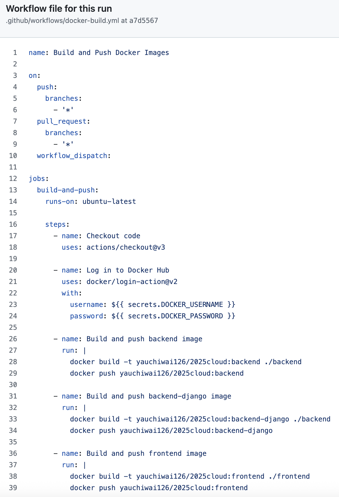

# Git Repo README & Dockerfile

## README有清楚描述如何透過docker build打包你的應用程式

### 使用指令進行打包
`docker-compose build`

### 使用指令為Image加上Tag
`docker tag csie5217-hw4-backend yauchiwai126/2025cloud:backend`
`docker tag csie5217-hw4-frontend yauchiwai126/2025cloud:frontend`
`docker tag csie5217-hw4-backend-django yauchiwai126/2025cloud:backend-django`

### 使用指令把Image推到Docker Hub
`docker push yauchiwai126/2025cloud:backend`
`docker push yauchiwai126/2025cloud:frontend`
`docker push yauchiwai126/2025cloud:backend-django`

## README有清楚描述如何透過docker run運行你Container Image

### 使用指令運行所有的Container Image
`docker-compose up -d`

### 或者：先把所有的Container Image拉下來
`docker pull yauchiwai126/2025cloud:backend`
`docker pull yauchiwai126/2025cloud:frontend`
`docker pull yauchiwai126/2025cloud:backend-django`

### 然後：把所有的Container Image運行起來
`docker run -d -p 8080:80 --name backend yauchiwai126/2025cloud:backend`
`docker run -d -p 8000:8000 --name backend-django yauchiwai126/2025cloud:backend-django`
`docker run -d -p 3000:8001 --name frontend yauchiwai126/2025cloud:frontend`

# 文件詳述
## README以圖文的方式描述目前專案自動化產生Container Image的邏輯，以及Tag的選擇邏輯
### 自動化產生Container Image的邏輯

1. 當任何一個Branch在發起Push或者Pull Request的時候，GitHub Action便會運行(第3-10行)。
2. 登入Docker Hub(第20-24行)。
3. 建立Docker Image(第28、33、38行)。
4. 把Docker Image推送到Docker Hub(第29、34、39行)。
### Tag的選擇邏輯
- Tag是根據前端(frontend)及後端(backend)分開建立的。
- 如果裡面有其他特別的元件則另外在前/後端後再加上該元件的名稱(backend-django)。